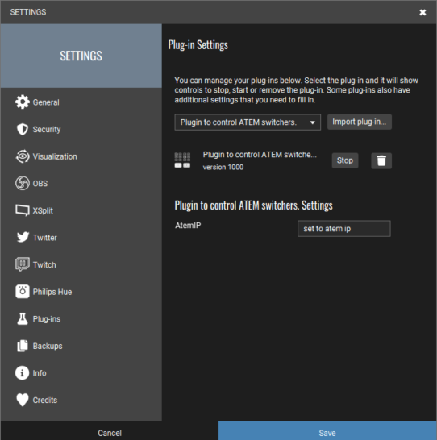

# touch-portal-atem
This is a Touch Portal plugin that will let you control the ATEM mini switcher. Right now it only has bi-directional source switching on the program.

## Goals:

1. The original goal is to combine it with the use of OBS to create complex scene switching so that at the touch of a touch portal button, the source can be changed on the ATEM and the scene will be  switched to a specified scene in OBS

2. When the source on the ATEM is switched. The scene should also be switched in OBS. This works by using the event "When the ATEM source is x" under the plugin.

## Configuration

Configuration is done in Touch Portal as of version 2.3.0. using the built in settings mechanism.

1. Go to the Settings cog at the top right of the Touch Portal main window.
2. Select the Plugins page.
3. Select Plugin to control ATEM switchers from the list on that page.
4. Enter the ip address of your ATEM in the AtemIP box.

## Touch Portal Setup

### Button Press

Setup a button press using the action of "Set the source of the ATEM to x"

You can also combine it with other actions from OBS or any other TP action to do whatever you want!

Sample:

### On Event

Use "When the ATEM source is x" event to respond when a button is pressed on the atem. The sample below sets the OBS scene to a corresponding scene (at the bottom of the screenshot).

Sample:

## Roadmap

The initial version only has bi-directional source changes on the program source. 

Other plans (need to learn more about how the ATEM works):

* split out program / preview actions and states
* create actions to set transition settings
* actions and states for picture in picture
* actions and events for upstream and downstream keying

Those are the things I see off the top of my head. I know there is a ton more that the ATEM can do

Feel free to fork and contribute.

