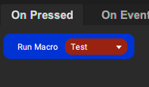
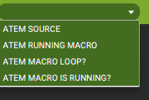

# Touch Portal Plugin To Control ATEM Switchers


- [Touch Portal Plugin to Control ATEM switchers](#touch-portal-plugin-to-control-atem-switchers)
  - [Description](#description)
  - [ChangeLog](#changelog)
  - [Goals](#goals)
  - [Intallation and Configuration](#installation-and-configuration)
  - [Usage](#usage)
    - [Button Press](#button-press)
    - [On Event](#on-event)
    - [States](#states)
  - [Roadmap](#roadmap)

## Description:
This is a Touch Portal plugin that will let you control the ATEM switchers. Right now it only has bi-directional scene switching on the program. **Latest Update** has support for ***macros***

## ChangeLog
```
v1.0.0 - First release
  Additions:
    - Action for Program Source Changes
    - State for Program Souce
    - Event for Program Souce
		- This is a convenience function to easily set up actions when the source changes. It's better to use the When Plugin State Changes for more flexibility
v1.1.0
  - Action for Run Macro
  - Action to toggle Macro loop
  - Action to Stop Macro
  - State for Atem Running Macro
    - This is the macro name
  - State for if ATEM MACRO IS RUNNING? (true/false)
  - State for ATEM MACRO LOOP? (true/false)
  
```


## Goals:

1. The original goal is to combine it with the use of OBS to create complex scene switching so that at the touch of a touch portal button, the source can be changed on the ATEM and the scene will be  switched to a specified scene in OBS

2. When the source on the ATEM is switched. The scene should also be switched in OBS. This works by hooking into the custom plugin state ATEM_SOURCE using the "When plugin state changes" built in event (under logic)

## Installation and Configuration

The plugin has been updated so that it now uses Touch Portal v 2.3.0 as a minimum. Touch Portal 2.3.0 has built in plugin configuration settings.

1. Click the Settings Cog at the top right of main Touch Portal window.
2. Select the Plugins page
3. Select the 

## Usage


### Button Press

* Setup a button press using the action of "Set the source of the ATEM to x"

You can also combine it with other actions from OBS or any other TP action to do whatever you want!

Sample:


* Run a macro using the action of "Run Macro" and select the macro from the list.

Sample:



### On Event

Use the built in "When plugin state changes" event to trigger changes such as visual indicators or perform actions

Sample:


### States



* ATEM SOURCE - The current progtam souce selected on the atem
* ATEM RUNNING MACRO - The name of the currently running macro
* ATEM MACRO LOOP? - true/false value if the macro loop is enabled
* ATEM MACRO IS RUNNING? - true/false value if a macro is running

## Roadmap

The initial version only has bi-directional source changes on the program source. 

Other plans (need to learn more about how the ATEM works):

* split out program / preview actions and states
* create actions to set transition settings
* actions and states for picture in picture
* actions and events for upstream and downstream keying

Those are the things I see off the top of my head. I know there is a ton more that the ATEM can do


Feel free to fork and contribute.


