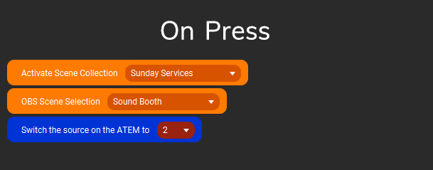
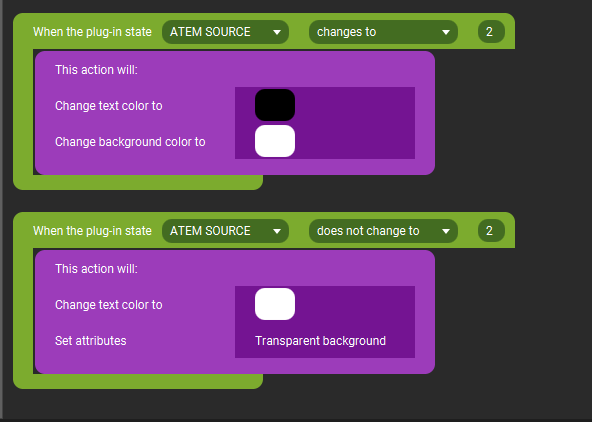

# touch-portal-atem
This is a Touch Portal plugin that will let you control the ATEM mini switcher. Right now it only has bi-directional scene switching on the program.

## Goals:

1. The original goal is to combine it with the use of OBS to create complex scene switching so that at the touch of a touch portal button, the source can be changed on the ATEM and the scene will be  switched to a specified scene in OBS

2. When the source on the ATEM is switched. The scene should also be switched in OBS. This works by hooking into the custom plugin state ATEM_SOURCE using the "When plugin state changes" built in event (under logic)

## Configuration

There is a settings.json file in the plugin directory. It should be installed in %APPDATA%\touch-portal-atem on windows. Use this to set the atem ip address.

```javascript
{
    "atem_ip": "x.x.x.x"
}
```

## Touch Portal Setup


### Button Press

Setup a button press using the action of "Set the source of the ATEM to x"

You can also combine it with other actions from OBS or any other TP action to do whatever you want!

Sample:



### On Event

Use the built in "When plugin state changes" event to trigger changes such as visual indicators or perform actions

Sample:




## Roadmap

The initial version only has bi-directional source changes on the program source. 

Other plans (need to learn more about how the ATEM works):

* split out program / preview actions and states
* create actions to set transition settings
* actions and states for picture in picture
* actions and events for upstream and downstream keying

Those are the things I see off the top of my head. I know there is a ton more that the ATEM can do


Feel free to fork and contribute.


